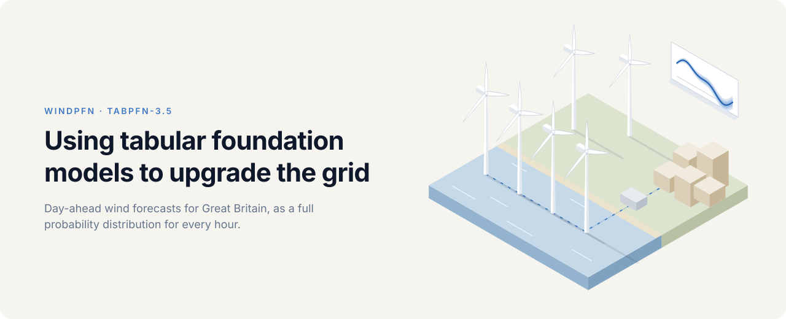

## Why it matters

Wind made a third of Great Britain's electricity in 2025. The grid is planned a day ahead around the system operator's forecast of that wind, and whatever the forecast gets wrong has to be fixed on the day, by starting up reserve plant or by paying wind farms to switch off.

That correction is expensive. NESO's day-ahead wind forecast missed by 9.4 TWh in 2025, a year in which balancing the grid cost £2.3bn. Every 10% cut in that miss is worth about £20m a year, and the figure grows with each new gigawatt of wind.

## What we did

We gave TabPFN-3.5, a tabular foundation model, three things anyone can download: NESO's own forecast, ECMWF's open weather forecast, and a history of what the wind actually produced. There is no training and no tuning. Each forecast is a single forward pass, and it comes back as a full probability distribution for every hour rather than one number.

On 623 days it had never seen, from January 2025 to September 2026, it cut NESO's error by 11–14%, and its uncertainty bands held the right share of outcomes without any calibration step. It now runs [live](https://csomers3.github.io/tabPFN4wind/), fifteen minutes after every NESO update.


## How it works

Each forecast uses only what was public at the moment it was made.

- **Weather**: ECMWF's AIFS wind forecast at 20 points, each the capacity-weighted centre of a cluster of British wind farms, turned into expected output with a standard turbine power curve.
- **NESO's forecast**: the very update it is competing with.
- **Context**: every hour whose real output had settled at least a day earlier, refreshed monthly. That is 6,944 hours in January 2025 and 21,537 by September 2026.
- **Target**: metered wind plus the wind NESO paid farms to switch off, which is what NESO's forecast aims at.

The model itself is three lines:

```python
model = TabPFNRegressor.create_default_for_version("v3.5")
model.fit(features[train], (table.y / table.cap)[train])
deciles = model.predict(features[test], output_type="quantiles", quantiles=QUANTILES)
```

## Results

The test protocol was fixed before any test score existed (commit `8e4386d`), and the test was scored once, on ECMWF's IFS weather. The pipeline then moved to the open AIFS archive, which anyone can query, and was rerun with nothing else changed. Both runs are shown.

| 14,952 hours, MW | MAE | vs NESO [95% CI] | CRPS | 10–90% coverage | Winkler |
|---|---|---|---|---|---|
| NESO | 1,022 | | 1,022 | | |
| NESO + conformal band | 1,004 | −18 [−30, −6] | 788 | 79.2% | 4,659 |
| LightGBM · AIFS | 929 | −93 [−121, −65] | 737 | 67.2% | 4,492 |
| **TabPFN-3.5 · IFS** | **912** | **−109 [−146, −72]** | **714** | **80.6%** | **4,195** |
| **TabPFN-3.5 · AIFS** | **876** | **−146 [−183, −110]** | **685** | **81.9%** | **4,009** |

Lower is better, and the 10–90% band should hold 80% of hours. Intervals resample whole days. The two references were added after the test and tuned on 2024 only.

- **The gain comes from the weather, and TabPFN uses it best.** Recalibrating NESO's forecast on its own errors recovers only 18 MW. On identical inputs, TabPFN beats a tuned LightGBM by 53 MW (95% CI 24 to 84).
- **Its uncertainty is honest out of the box.** Every central band holds within 2.5 points of its target, and its 10–90% band is 11% narrower than the recalibrated one. LightGBM's bands fall up to 13 points short.
- **It fails when the weather forecast does.** On its eight worst days against NESO, only 35–42% of hours fell inside its 10–90% band. During Storm Éowyn it overshot by more than 2 GW while NESO was within 0.1 GW.


Prior Labs' performance tips, from ratio features and native dates to Thinking mode and per-estimator subsampling, were all tried on 2024 data. None beat the defaults.

## Live

A scheduled job runs after each of NESO's eight daily updates and commits the new forecast to `notebooks/public/live.csv`, so every forecast is on record before its outcome is known. The [live page](https://csomers3.github.io/tabPFN4wind/) draws it against outturn fetched from Elexon as the page loads.


## Run it

Python 3.12 or later.

```bash
git clone https://github.com/CSomers3/tabPFN4wind && cd tabPFN4wind
python -m venv .venv && source .venv/bin/activate   # Windows: .venv\Scripts\activate
pip install -e ".[tabpfn,notebooks]"

windpfn-score                     # the results table above, offline
marimo edit notebooks/sample.py   # the whole pipeline on a six-month sample, in about a minute
```

The sample runs offline with the two references. To add TabPFN-3.5, which runs on Prior Labs' hosted API, set `TABPFN_TOKEN` to your Prior Labs token before starting marimo.

The code is five modules in `src/windpfn/`: `sources`, `weather`, `dataset`, `forecasting` and `evaluation`. The notebooks only read from them.

| | |
|---|---|
| `01_data` | what is known when, the target, the benchmark and the cost of NESO's error |
| `02_development` | the 2024 development runs (needs a token) |
| `03_test` | the held-out results and figures, offline |
| `04_references` | the LightGBM and conformal references |
| `05_live` | the live chart |

`windpfn-fetch` pulls every raw input, logging each with its URL and checksum. `windpfn-backtest` regenerates the held-out forecasts, and `windpfn-live` issues a new one. `data/` holds every input since April 2024, the six-month sample, and the committed held-out forecasts.

## Limitations

- **It post-processes NESO's forecast**, so it needs that forecast as an input.
- **The target is reconstructed.** NESO publishes no output before curtailment, and wind farms that switch themselves off at negative prices, in about 3% of hours, are missing from it.
- **The weather input is coarse**: 20 points on a 0.25° grid, 6-hourly, with wind at 10 m.
- **The AIFS run came after the IFS score was known**, with nothing else changed.

Data: Elexon BMRS, ECMWF AIFS via dynamical.org (CC BY 4.0), REPD (OGL v3.0). Code: MIT.
