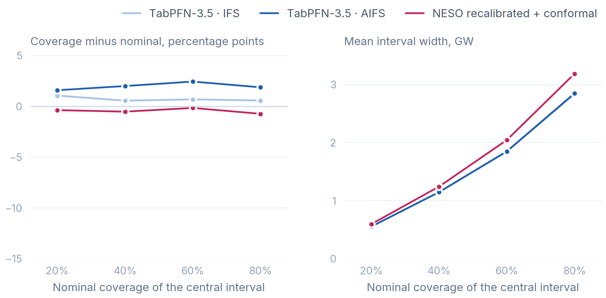
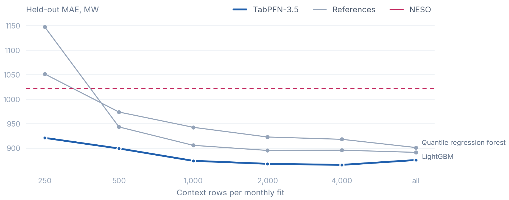

# TabPFN-3.5 for Great Britain's day-ahead wind forecast

TabPFN-3.5 post-processes the system operator's day-ahead wind forecast from public weather and outturn data, with no training and no tuning.
On 623 held-out days, the median forecast has 11% lower mean absolute error than NESO's (912 vs 1,022 MW), and the 80% interval holds 80.6% of hours.
We deploy this probabilistic forecast live and updated eight times a day - see **[csomers3.github.io/tabPFN4wind](https://csomers3.github.io/tabPFN4wind/)**

Wind supplies a third of Great Britain's electricity, and the grid is scheduled a day ahead on NESO's forecast of it. Any misses in the forecast can result in costly balancing actions, which ultimately inflate the cost of energy for consumers (~£1.5B in 2025, see **[https://wastedwind.energy/](https://wastedwind.energy/)**). NESO has been making strides in forecasting advancements to the UK grid partnering with OpenClimateFix **[see here](https://www.openclimatefix.org/insights/neso-adopts-ai-solar-forecasting-control-room)**. We used residual correction of NESO's own published forecast to enhance it using AI forecasting. 

### Results

Held out: 2025-01-01 to 2026-09-15, 14,952 hours. All intervals are central intervals of the predictive distribution.

| MW | MAE | ΔMAE vs NESO [95% CI] | CRPS | 80% interval coverage | Winkler |
|---|---|---|---|---|---|
| NESO | 1,022 | | 1,022 | | |
| NESO recalibrated + conformal interval | 1,004 | −18 [−30, −6] | 788 | 79.2% | 4,659 |
| **TabPFN-3.5** | **912** | **−109 [−146, −72]** | **714** | **80.6%** | **4,195** |
| TabPFN-3.5 · AIFS | 876 | −146 [−183, −110] | 685 | 81.9% | 4,009 |

The gain comes from the weather. Correcting NESO's forecast with its own past errors recovers 18 MW, and TabPFN-3.5 with the weather recovers 109. The bold row reads ECMWF IFS weather, and the AIFS row reads the open archive the package uses now.

CRPS scores the whole distribution and equals MAE for a single forecast. Winkler adds 10 times any miss to the 80% interval's width. Brackets are 95% intervals over whole days.

### Why TabPFN

**Against tuned references.** A quantile LightGBM and a quantile regression forest got TabPFN-3.5's exact inputs and monthly refits, tuned on Jul–Dec 2024 ([`04`](notebooks/04_references.py)).

| MW | MAE | ΔMAE vs TabPFN-3.5 [95% CI] | CRPS | 80% interval coverage | Winkler |
|---|---|---|---|---|---|
| **TabPFN-3.5 · AIFS** | **876** | | **685** | **81.9%** | **4,009** |
| LightGBM | 891 | +16 [−4, +36] | 706 | 66.2% | 4,325 |
| Quantile regression forest | 901 | +25 [+8, +44] | 713 | 88.0% | 4,279 |

**Calibration.** The medians are close, but the distributions are not. TabPFN-3.5's intervals are within 2.5 points of nominal coverage at every level, with no calibration step. LightGBM's are 5 to 14 points short and the forest's 5 to 10 over. The conformal band is on nominal by construction but 10% wider.



*Coverage minus nominal (left) and mean width (right) of central intervals from 20% to 80%.*

**Less context.** At 250 context rows a month TabPFN-3.5 still beats NESO at 921 MW. LightGBM falls to 1,148 and the forest to 1,051.



**The defaults were already the best setting.** We tried each of Prior Labs' performance suggestions and raw weather columns on Jul–Dec 2024, where the default scores 805 MW against NESO's 931 ([`02`](notebooks/02_development.py)). None was a reliable gain.

| Suggestion | Jul–Dec 2024 MAE, MW |
|---|---|
| Default TabPFN-3.5, 66 numeric columns | 805 |
| Ratio features, NESO's forecast as capacity factor and a fleet-wide power curve | 809 and 806 |
| Native datetime column in place of hour and day-of-year sin/cos | 818 |
| Raw 10 m speed and direction (degrees) in place of power curves and sin/cos | 794, ΔMAE −10 [−33, +11] |
| Thinking mode (mean only, so no intervals), against the default mean | 799 vs 809, CI includes 0, about 5× the tokens |
| Per-estimator subsampling (50,000 rows each) against one 50,000-row draw, every NESO update, Nov–Dec | 868 vs 864 |

TabPFN-3.5 does not need the hand-made power curve. On the raw weather it scores the same, within noise.

### Methods

Each forecast used only what was public at its issue time, 15 minutes after NESO's last update before 08:30 UTC the day before (lead times 16 to 39 h). `dataset.check` enforces this on every row.

- **Weather.** ECMWF 10 m wind every 6 hours at 20 points, one per cluster of wind farms, raised to hub height and mapped through a generic power curve. Direction enters as sin and cos.
- **NESO's forecast.** The update being post-processed.
- **Target.** Metered transmission wind plus wind curtailed in the balancing mechanism, as a share of installed capacity. That is what NESO forecasts. Regressed on NESO's forecast its slope is 1.00, against 0.80 for metered output alone.
- **Context.** Every hour settled at least a day before issue, refit monthly, from 6,944 hours in January 2025 to 21,537 by September 2026.

```python
model = TabPFNRegressor.create_default_for_version("v3.5")
model.fit(features[train], (table.y / table.cap)[train])
deciles = model.predict(features[test], output_type="quantiles", quantiles=QUANTILES)
```

The point forecast is the median. The live forecast runs after every NESO update, learns from a 50,000-row sample of all past updates, adds the latest metered output and publishes 99 percentiles.

**Design decisions.** The target is capacity factor, not MW, so the context spans capacity growth. A one-day embargo covers curtailment data whose first publication time is unknown. Weather alone only ties NESO, at 1,026 MW, so NESO's forecast is an input.

### Reproduce

```bash
make score    # Docker: builds the package and prints every table above from the committed forecasts
```

Or without Docker, on Python 3.12.

```bash
git clone https://github.com/CSomers3/tabPFN4wind && cd tabPFN4wind
pip install -e ".[tabpfn,references,notebooks]"
windpfn-score                     # the tables above, offline, in seconds
marimo edit notebooks/sample.py   # the whole pipeline on a six-month sample
```

| Command | Output |
|---|---|
| `windpfn-fetch` | every raw input from Elexon BMRS, dynamical.org and NESO, each logged with its URL and sha256 checksum |
| `windpfn-backtest tabpfn` | the held-out TabPFN-3.5 forecasts from `data/history/` (needs `TABPFN_TOKEN`) |
| `windpfn-backtest references`, `ablation`, `context` | the reference forecasts, the ablation on identical inputs, and the context-size runs |
| `windpfn-live` | a new live forecast |

`data/` holds every input from April 2024, a six-month sample and all held-out forecasts. Notebooks [`01`](notebooks/01_data.py) to [`05`](notebooks/05_live.py) rebuild every number and figure from the package. A [scheduled GitHub Action](https://github.com/CSomers3/tabPFN4wind/actions/workflows/live.yml) commits each live forecast to `notebooks/public/live.csv` before its outturn exists.

### Limitations

- The method post-processes NESO's forecast, not a replacement.
- The target is reconstructed. Wind farms that curtail themselves at negative prices are missing from it, as this is a farm-level decision.
- The weather input is coarse, 10 m wind at 20 points on a 0.25° grid every 6 hours.
- Errors follow the weather forecast. On the eight days TabPFN-3.5 lost most to NESO, 35% to 42% of hours fell inside its 80% interval. During Storm Éowyn (24 January 2025) its daily bias was +2.2 GW against NESO's −0.1 GW, leaving scope for learning physical processes and their limitations (wind turbines are only rated up to a certain wind speed, and must turn off otherwise to prevent damage).

Contains BMRS data © Elexon Limited copyright and database right 2026 · NESO balancing costs, supported by National Energy System Operator Open Data · ECMWF AIFS via dynamical.org (CC BY 4.0) · REPD (OGL v3.0) · Code under [Apache-2.0](LICENSE)
