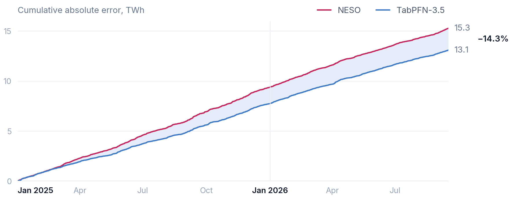
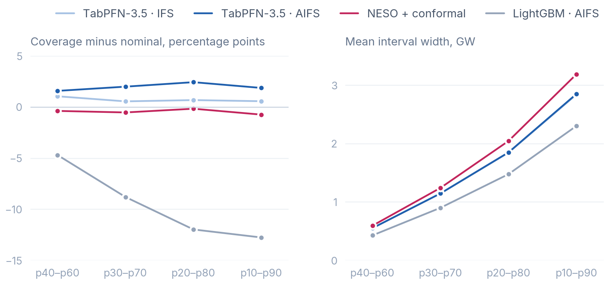
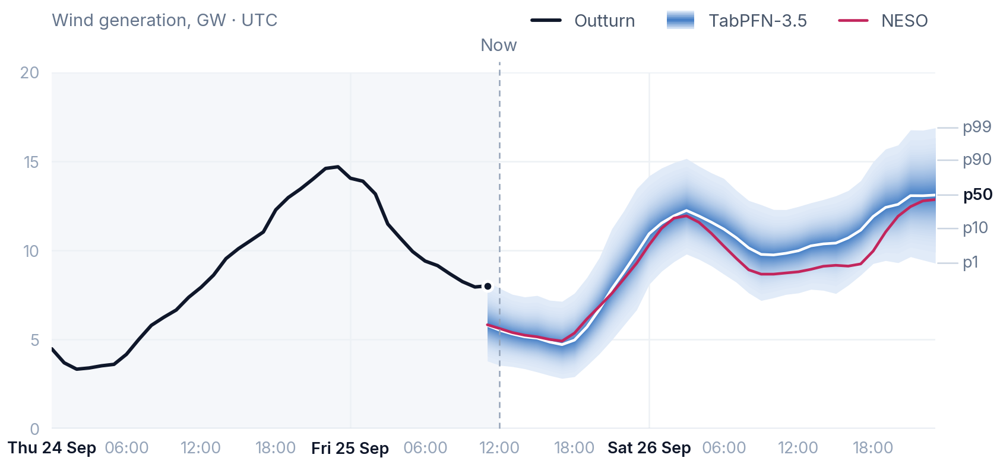

# windpfn: TabPFN-3.5 beats the GB grid operator's wind forecast

Day-ahead hourly wind forecasts for Great Britain from TabPFN-3.5 and public weather, issued fifteen minutes after NESO's own, with its uncertainty attached.

Wind generated a third of Great Britain's metered electricity in 2025, second only to gas, and the grid is planned a day ahead on NESO's forecast of it. What that forecast misses is balanced close to real time: NESO spent £2.3bn balancing the system in 2025, most of it on network constraints. WINDFOR missed by 9.4 TWh over the year. Priced at the gap between the imbalance and market prices, cutting that miss by 10% is worth about £20m a year ([how](notebooks/01_data.py)).



Every morning NESO, Great Britain's system operator, publishes WINDFOR: its forecast of tomorrow's hourly wind output. Fifteen minutes later, windpfn gives TabPFN-3.5 that forecast, the newest public ECMWF AIFS weather run and every settled hour of outturn so far. It returns nine deciles per hour. TabPFN-3.5 is not trained or tuned for this task. It reads the history in context.

## Results

623 held-out days (2025-01-01 → 2026-09-15), scored once under a protocol frozen beforehand ([`8e4386d`](../../commit/8e4386d)).

| 14,952 hours | MAE | CRPS | 10–90% coverage | 10–90% width | Winkler, 10–90% |
|---|---|---|---|---|---|
| NESO WINDFOR | 1,022 | 1,022 ¹ | — | — | — |
| WINDFOR, recalibrated + conformal band ² | 1,004 | 788 | 79.2% | 3,185 | 4,659 |
| LightGBM, same inputs ² | 929 | 737 | 67.2% | 2,300 | 4,492 |
| **TabPFN-3.5** | **912** | **714** | **80.6%** | 2,836 | **4,195** |

MW, lower is better; coverage targets 80%. ΔMAE vs WINDFOR: −109 MW (−10.7%), 95% day-block bootstrap [−146, −72].  
¹ For a point forecast, CRPS equals MAE. ² Added after the test, tuned on 2024 only. TabPFN was never rerun.

**Most of the gain needs weather.** Recalibrating WINDFOR by its own error at each forecast level recovers only 18 of the 109 MW. A tuned LightGBM on the same inputs recovers 93. It ends 17 MW behind TabPFN (95% CI −3 to +37), so the two are not clearly separated on point accuracy.

**The distribution is what TabPFN adds.** Its deciles cover 80.6% on an 80% target with no calibration step. Its interval is 11% narrower than the conformal band, and it has the best Winkler score, which combines width with a penalty for misses. LightGBM's interval is narrower still, but it covers only 67%. TabPFN's coverage holds at every forecast level, 78–82% in each quartile of its forecast, but not on its worst days: on the eight it lost worst to NESO, outturn fell inside the band in only 35% of hours. All eight were windy, seven in the top quarter of days by output, and on each the weather-only power curve missed in the same direction. On 24 January 2025, Storm Éowyn, NESO's daily bias was −0.1 GW and TabPFN's was +2.3 GW.



## Quick start

Python 3.12 or later.

1. Install, with the TabPFN client:

   ```bash
   git clone https://github.com/CSomers3/tabPFN4wind && cd tabPFN4wind
   python -m venv .venv && source .venv/bin/activate   # Windows: .venv\Scripts\activate
   pip install -e ".[tabpfn]"
   ```

2. Run the pipeline on the bundled sample, offline. It forecasts Aug–Sep 2026 with LightGBM and the conformal band, in under a minute:

   ```bash
   windpfn-sample
   ```

3. Add TabPFN-3.5. It runs on Prior Labs' hosted API, so it needs a token from a Prior Labs account:

   ```bash
   export TABPFN_TOKEN=<your token>   # PowerShell: $env:TABPFN_TOKEN = "<your token>"
   windpfn-sample --tabpfn
   ```

4. Rebuild the results table above from the committed held-out forecasts:

   ```bash
   windpfn-score
   ```

`windpfn-sample` runs the full pipeline on six months of recent inputs in [data/sample/](data/sample): it builds the point-in-time table, then forecasts each month from every hour settled a day before it. Its context is far shorter than the backtest's, so its scores are a smoke test, not a result.

## What TabPFN-3.5 is doing

The whole model, from [src/windpfn/forecasting.py](src/windpfn/forecasting.py#L80-L84):

```python
from tabpfn_client import TabPFNRegressor  # optional extra; needs an API token

model = TabPFNRegressor.create_default_for_version("v3.5")
model.fit(features[train], (table.y / table.cap)[train])
predicted = model.predict(features[test], output_type="quantiles", quantiles=quantiles)
```

- **No training loop and no hyperparameter search.** It uses the default v3.5 checkpoint. The features were fixed on 2024.
- **In-context learning.** Each monthly refit just passes a larger context: 6,944 settled hours in January 2025, 21,537 by September 2026. With the context frozen at January, TabPFN still scores 922 MW.
- **Any quantile from one call.** Passing `np.linspace(.01, .99, 99)` returns the whole quantile function with no refit, where LightGBM needs one model per level. The comparisons above stay on nine deciles, so every model is scored on the same grid. The live forecast reads p1 to p99 off TabPFN's full predictive distribution.

## Live

A [GitHub Action](.github/workflows/live.yml) runs twenty minutes after each of NESO's eight daily updates. `windpfn-live` reads the full history in `data/history/`, pulls everything published since, and issues TabPFN-3.5's p1–p99 for every hour the update covers. The forecast is committed to `notebooks/public/live.csv`, so the git log records each one before its outturn, and the [live page](https://csomers3.github.io/tabPFN4wind/) ([notebooks/explorer.py](notebooks/explorer.py)) is redeployed. The page pulls outturn from Elexon on load.



## Data

| | |
|---|---|
| `data/sample/bmrs/` | from Elexon BMRS: every WINDFOR vintage, metered wind (FUELHH), balancing-mechanism curtailment of wind units (BOAV), and wind capacity by each unit's first metered output (B1610) |
| `data/sample/weather/` | ECMWF AIFS Single 10 m wind at the 20 points, every run, from dynamical.org |
| `data/history/` | the same inputs from 2024-04-01 to 2026-09-30, the live forecast's context |
| `data/points.csv` | the 20 points: capacity-weighted clusters of REPD wind farms |
| `data/test_forecasts.parquet` | TabPFN-3.5's held-out forecasts, 2025-01-01 → 2026-09-15 |
| `data/reference_forecasts.parquet` | LightGBM's and the conformal band's |
| `data/raw/` | not committed: every API response `windpfn-fetch` pulls, logged with its URL and sha256 |

The sample covers delivery days 2026-03-01 → 2026-09-15. `windpfn-fetch --start 2026-02-28 --end 2026-09-15 --out data/sample` rebuilds it, and `windpfn-fetch --end 2026-09-30 --out data/history` the history.

## Commands

`pip install -e ".[notebooks,tabpfn]"` installs everything. TabPFN-3.5 runs on Prior Labs' hosted API, and `tabpfn-client` asks you to log in on first use.

| | |
|---|---|
| `windpfn-sample` | forecast and score the bundled sample, offline |
| `windpfn-score` | the table above, offline from the committed forecasts in `data/` |
| `marimo edit notebooks/03_test.py` | held-out results and the error and calibration figures, offline |
| `marimo edit notebooks/05_live.py` | the live figure, a still of the live page's chart |
| `marimo run notebooks/explorer.py` | the hosted page, locally; `windpfn-page` refreshes its data in `notebooks/public/` |
| `windpfn-live` | issue p1–p99 from NESO's newest update into `notebooks/public/live.csv` (a token; the Action sets `TABPFN_TOKEN` from a repository secret) |
| `windpfn-fetch` | pull every raw input into `data/raw/`, each with its URL and sha256 (hours) |
| `windpfn-backtest references` | regenerate the LightGBM and conformal forecasts into `data/results/` |
| `windpfn-backtest tabpfn` | regenerate TabPFN's (raw pulls and a token) |

The pipeline lives in [src/windpfn/](src/windpfn), in five modules: `sources`, `weather`, `dataset`, `forecasting` and `evaluation`. The notebooks only read from it. Rebuilding the full table requires the raw pulls; the sample, the scores and the held-out figures do not.

## Caveats

The protocol, as frozen before the test, is in [`docs/method.md` at `8e4386d`](../../blob/8e4386d/docs/method.md).

- **This is post-processing.** WINDFOR is an input. On weather alone, TabPFN only ties NESO (1,026 vs 1,022).
- **The target is reconstructed.** NESO publishes no unconstrained outturn, so the target is metered wind plus balancing-mechanism curtailment. Self-curtailment at negative prices is missing, which affects about 3% of hours.
- **CRPS is approximate.** It is twice the mean pinball loss over nine deciles. There is also a one-day embargo on the context, because archived curtailment data can't show when it was first published.
- **The weather inputs are coarse.** They come from the grid points nearest 20 wind-capacity clusters, using ECMWF's AIFS Single 10 m wind at 0.25° and 6-hourly steps from dynamical.org (its 100 m wind starts only in 2025-02), and the archive starts 2024-04-01.

MIT licensed.
